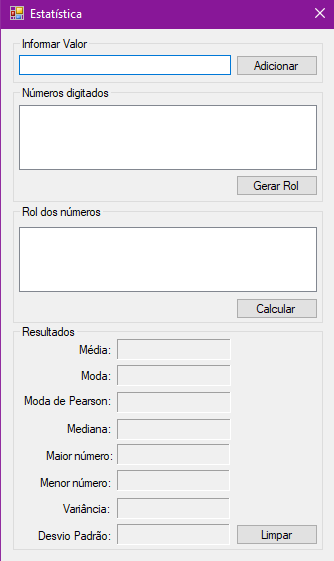

# Programa de Cálculos de Estatísticas 

Aplicação que gera um rol a partir de números informados pelo usuário e realiza cálculos estatísticos.

## Funcionalidades



- Aplicação Windows
- Geração de rol
- Calculo de Média
- Calculo de Moda
- Calculo de Moda de Pearson
- Calculo de Mediana
- Maior número informado
- Menor número informado
- Calculo de variância
- Calculo de desvio padrão

## Tecnologias
  - C#
  - Windows Forms
  - .NET Framework 4.7.2
## Rodando localmente

Instale as dependências

```bash
  https://dotnet.microsoft.com/en-us/download/dotnet-framework/net472
```

Clone o projeto

```bash
  git clone https://github.com/Je0225/Calculos-de-Estatistica.git
```

Entre no diretório do projeto

```bash
  cd  \Estatistica\bin\Debug\Estatistica.exe
```

